<div align="center">

# Orvexa

### Turn Team Work Into Visible Progress

A production-grade MERN operations and productivity platform. Projects, tasks,
a drag-and-drop board, real-time collaboration and analytics that are computed
from your actual data — not estimated, not decorative.

[](https://react.dev)
[](https://nodejs.org)
[](https://expressjs.com)
[](https://www.mongodb.com)
[](https://socket.io)

</div>

---

## Contents

- [What Orvexa is](#what-orvexa-is)
- [Feature tour](#feature-tour)
- [Screenshots](#screenshots)
- [Tech stack](#tech-stack)
- [Architecture](#architecture)
- [Database design](#database-design)
- [API reference](#api-reference)
- [Getting started](#getting-started)
- [Environment variables](#environment-variables)
- [Seeding demo data](#seeding-demo-data)
- [Testing](#testing)
- [Project structure](#project-structure)
- [Design system](#design-system)
- [Security](#security)
- [Performance](#performance)
- [Accessibility](#accessibility)
- [Deployment](#deployment)
- [Deliberate omissions](#deliberate-omissions)
- [Future work](#future-work)

---

## What Orvexa is

Most project tools show you a number. Orvexa shows you the number **and where it
came from**. Project health is not a colour someone picked — it is a score
derived from overdue counts, completion rate, deadline clustering and delivery
velocity, and it always states its reasoning in plain language:

> *"Project is at risk because 7 tasks are overdue, and only 24% of tasks are complete."*

That principle runs through the whole product. Every figure on the dashboard is
computed from task records by MongoDB aggregation at read time, so it cannot
drift from the truth. Where the data does not support a claim, nothing is shown
rather than a placeholder.

**The rule this codebase follows: if a feature appears in the UI, it works
end to end.** Nothing is stubbed, faked or marked "coming soon". Features that
could not be implemented honestly were removed instead — see
[Deliberate omissions](#deliberate-omissions).

---

## Feature tour

### Dashboard
KPI row with real week-on-week trends and sparklines · weekly progress ring
against your own goal · GitHub-style completion streak heatmap · goal tracking
· project health cards with reasons · deadlines bucketed by urgency ·
30-day created/completed chart · smart insights generated only when the data
supports them.

### Projects & tasks
Full project lifecycle with membership and roles · Kanban board with drag and
drop, persisted column ordering, and optimistic moves that roll back on failure
· task drawer with checklist, dependencies, labels, estimates, attachments,
comments and a timer · task dependencies with blocked-state indicators and
automatic notification when a blocker clears · milestones with live task
rollups · responsive Gantt-style timeline scaled to the project's real dates.

### Collaboration
Socket.IO with JWT handshake auth and per-user, per-project and per-task rooms ·
task, comment and project changes land on every open screen without a refresh ·
presence tracked per user (multiple tabs do not flicker you offline) · comments
with mentions · ten notification types with live unread counts.

### Analytics
Productivity trends over 7 / 30 / 90 / 365-day windows, scoped to everyone or
just you · distribution by status, priority and project · per-project analytics
with workload breakdown · team workload from real task counts · admin overview
with live system health.

### Personal productivity
My Work with Today / Focus / Upcoming / Overdue lanes · a Focus Score computed
transparently from the four inputs shown beside it · time tracking with one
running timer per user, manual entries and per-task actual-hours rollup ·
weekly goals whose progress is derived from completed tasks rather than a
stored counter.

### Experience
Dark, light and system themes tuned independently rather than inverted · three
eye-comfort levels implemented at the design-token layer (no yellow overlay) ·
command centre (`Ctrl`+`K`) · global search (`/`) · full keyboard shortcut map
(`?`) · desktop-only custom cursor that respects reduced-motion · skeletons,
empty states and offline-aware error states on every screen · optimistic UI
with rollback · honest offline detection that never claims a save that did not
happen.

---

## Screenshots

All screenshots are captured from the running application with seeded demo data —
every number shown is computed from MongoDB, not mocked.

### Landing

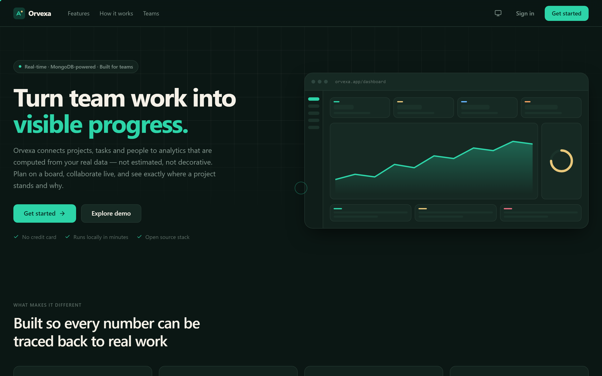

### Dashboard

Five KPIs from live aggregation pipelines, weekly progress, and insights derived
from real completion history.

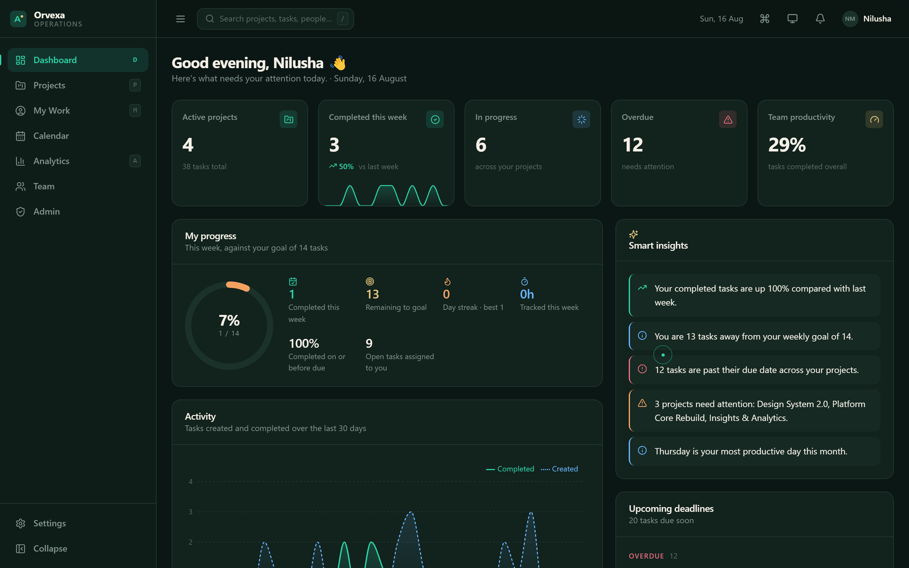

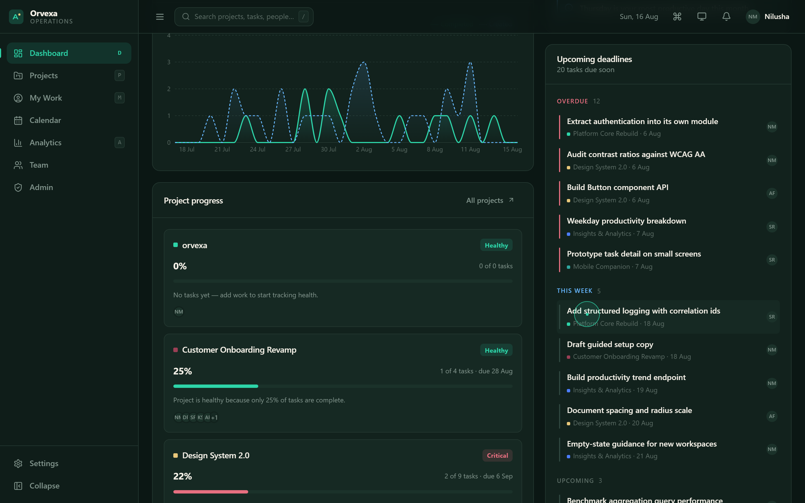

Project health always explains the score behind it.

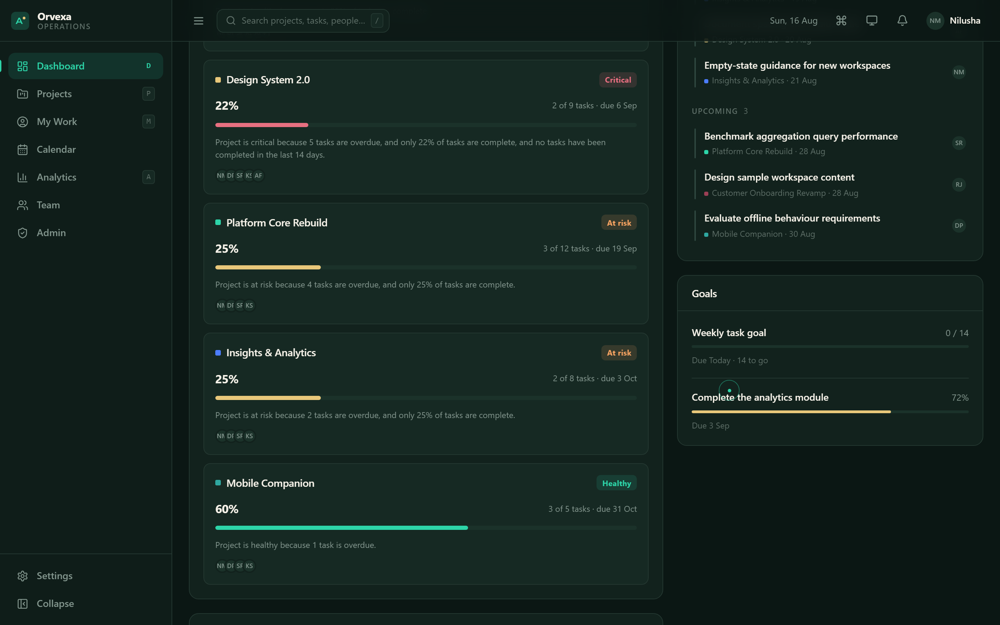

A GitHub-style contribution heatmap built from completion history.

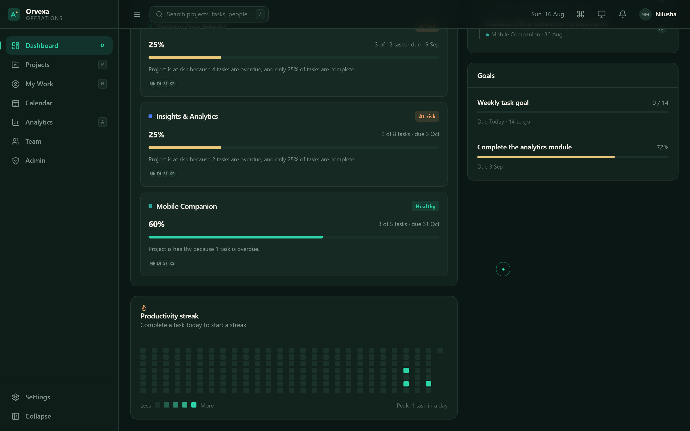

### Kanban board

Five columns with dnd-kit drag and drop, optimistic UI, and every move persisted
to MongoDB and broadcast over Socket.IO.

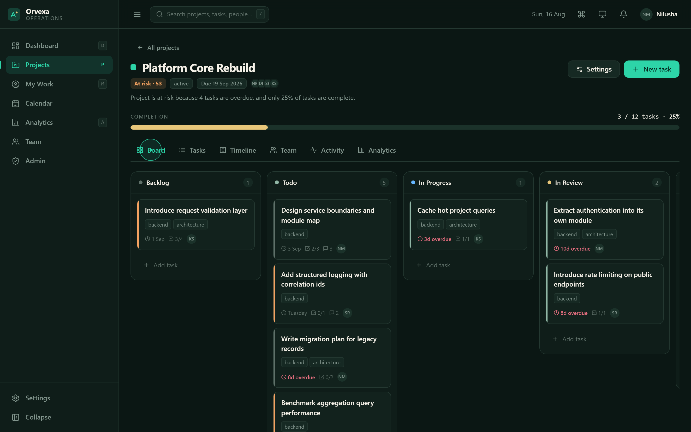

### Project workspace

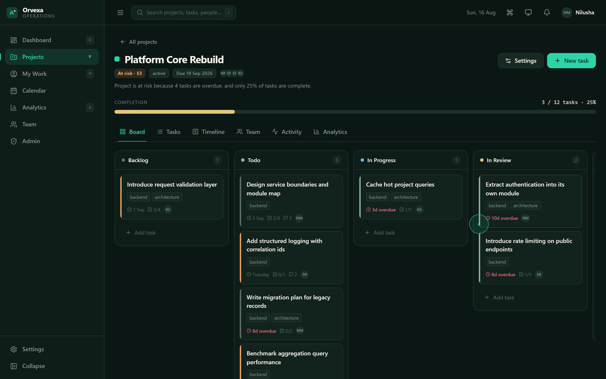

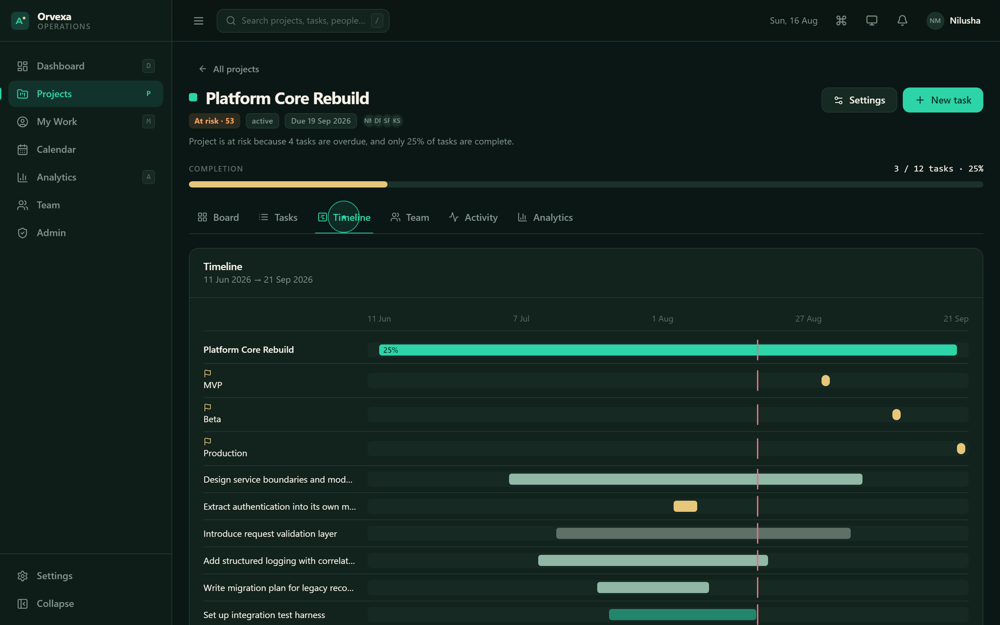

### Personal productivity

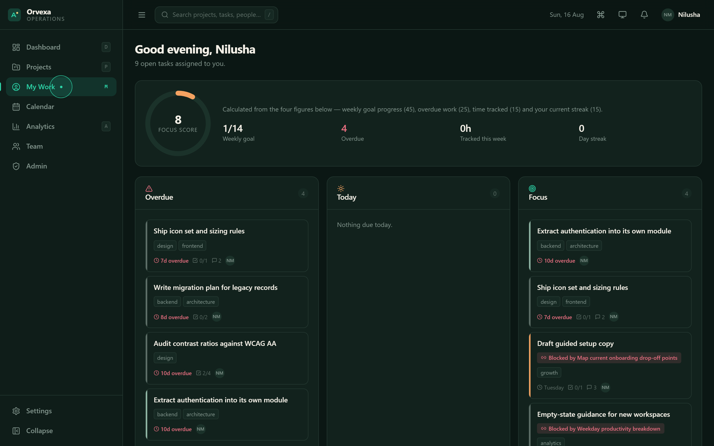

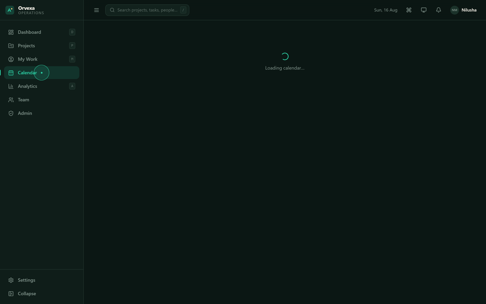

### Analytics

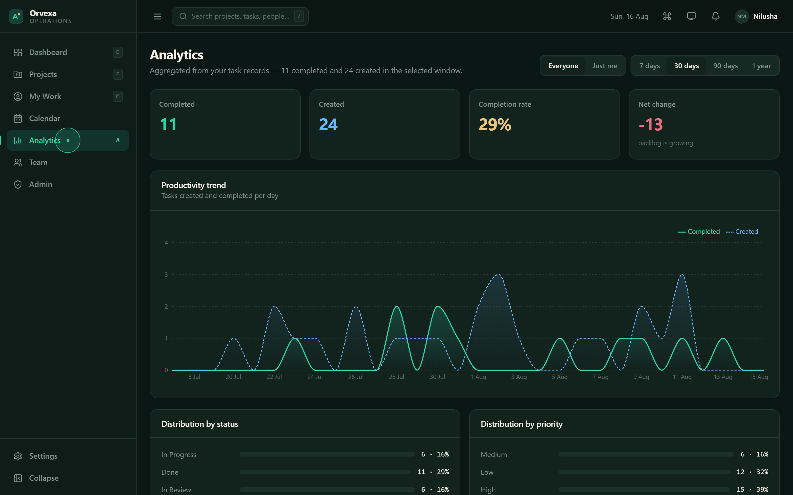

### Team, admin and settings

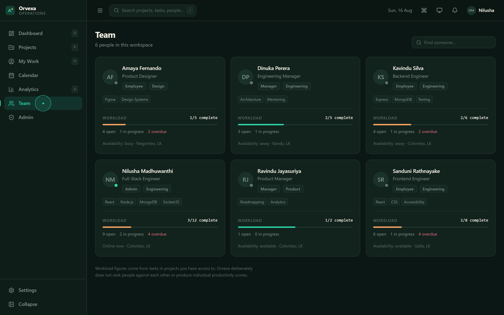

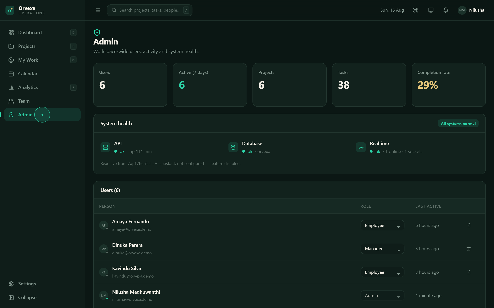

Light / Dark / System themes plus Normal, Comfort and Focus eye-comfort modes,
applied at the design-token level.

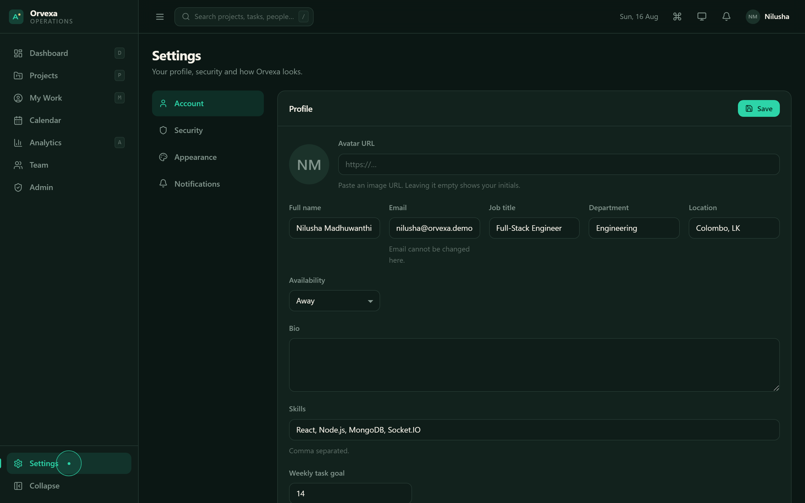

### Authentication

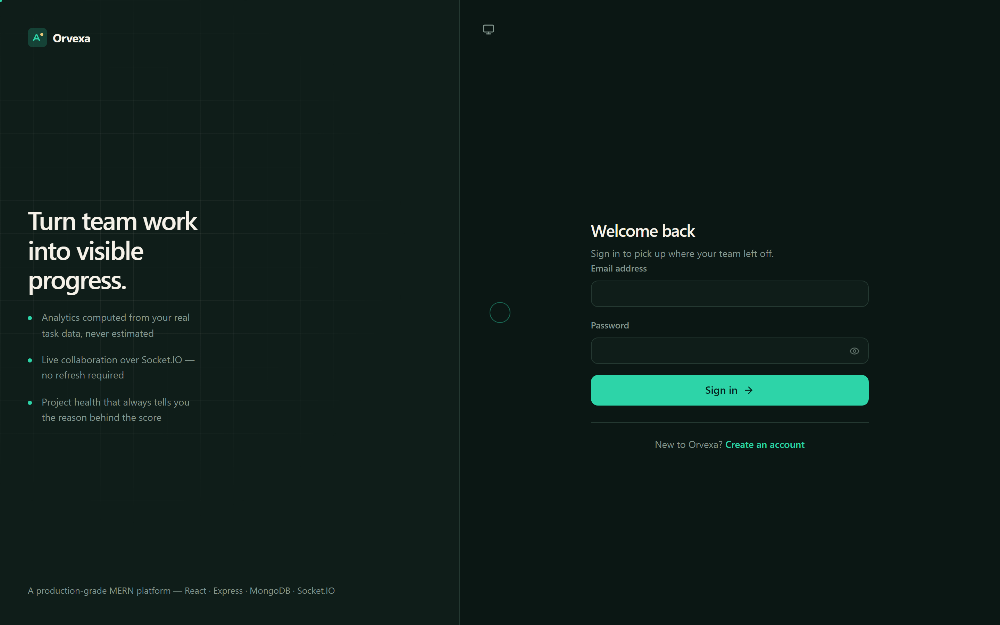

---

## Tech stack

**Frontend** — React 18, Vite 6, React Router 6, Zustand, Recharts, dnd-kit,
Framer Motion, Axios, date-fns, Lucide icons. No CSS framework: the design
system is hand-built on CSS custom properties.

**Backend** — Node.js 18+, Express 4, MongoDB 8, Mongoose 8, Socket.IO 4,
JSON Web Tokens, bcryptjs, Zod, Helmet, express-rate-limit,
express-mongo-sanitize, Swagger (swagger-jsdoc + swagger-ui-express), Multer.

**Tooling** — npm workspaces via `concurrently`, Node's built-in test runner,
nodemon.

---

## Architecture

```
┌──────────────────────────────────────────────────────────────┐
│                    React (Vite) — port 5173                  │
│  pages · components · layouts · hooks · Zustand stores       │
└───────────────┬──────────────────────────┬───────────────────┘
                │ REST (axios)             │ WebSocket (socket.io-client)
                ▼                          ▼
┌──────────────────────────────────────────────────────────────┐
│                 Express + Socket.IO — port 5000              │
│                                                              │
│   routes  →  middleware  →  controllers  →  services         │
│                (auth, RBAC,      │            (analytics,    │
│                 validation)      │             notifications,│
│                                  │             tokens, audit)│
│                                  ▼                           │
│                            Mongoose models                   │
└──────────────────────────────┬───────────────────────────────┘
                               ▼
                   ┌───────────────────────┐
                   │       MongoDB         │
                   │  aggregation pipelines│
                   └───────────────────────┘
```

**Request path** — React → axios → Express route → middleware
(`protect` → `authorize` → `loadProject` → `validate`) → controller → service →
Mongoose → MongoDB → response → Zustand/local state → UI.

**Real-time path** — mutation in a controller → `emitToProject` /
`emitToUser` → Socket.IO room → client `useRealtime` hook → state merge → UI.

### Design decisions

**Access tokens live in memory, not localStorage.** That removes the XSS
token-theft path. Refresh tokens sit in an httpOnly cookie and are **rotated**
on every refresh, with the used token removed from the user document so a
stolen refresh token cannot be replayed. A single-flight interceptor means a
burst of concurrent 401s triggers exactly one refresh call.

**Derived over stored.** Progress, health, goal figures and streaks are
computed from task records at read time. A stored counter can drift from
reality after a delete, a bulk update or a failed write — a derived value
cannot.

**The server is the authority.** Every permission check exists on the server.
`authorize(...roles)` guards role-restricted routes and `loadProject()`
additionally asserts project membership, so a valid token for one workspace
cannot read another project's tasks. The UI mirrors these rules; it does not
define them.

**ES modules everywhere.** The backend uses `"type": "module"` so there is one
module dialect across the repository.

---

## Database design

Nine collections with validation, references, compound indexes and text indexes.

| Model | Purpose | Notable fields & indexes |
|---|---|---|
| **User** | Accounts, roles, profile | `email` unique · text index on name/email/jobTitle · `refreshTokens` (select:false) · `weeklyTaskGoal` |
| **Project** | Project lifecycle & membership | `members[{user, projectRole}]` · compound `{members.user, status}` · text index · `hasMember()` |
| **Task** | The core work unit | compound `{project, status, order}` and `{assignee, status, dueDate}` · `completedAt` kept in sync with status · virtuals `isOverdue`, `checklistProgress` |
| **Comment** | Task discussion | `{task, createdAt}` · `mentions[]` · text index |
| **Notification** | Ten notification types | `{recipient, read, createdAt}` |
| **Activity** | Immutable audit trail | `{project, createdAt}` · created-only timestamps |
| **Milestone** | Project checkpoints | `{project, dueDate}` |
| **Goal** | Personal goals | `task_count` goals derive progress from real tasks |
| **TimeEntry** | Timer & manual entries | `{user, startedAt}` · duration computed on stop |

### Relationships

```
User ──owns──────────────► Project ──has──► Task ──has──► Comment
  │                            │              │
  └──assigned─────────────────-┼──────────────┘
                               ├──has──► Milestone
                               └──has──► Activity

User ──has──► Goal        Task ──dependsOn──► Task   (blocked state)
User ──has──► TimeEntry   User ──receives──► Notification
```

### Example: project health

Health is a real aggregation, not a stored field:

```js
// backend/src/services/analytics.service.js
const [agg] = await Task.aggregate([
  { $match: { project: oid(projectId) } },
  { $group: {
      _id: null,
      total:   { $sum: 1 },
      done:    { $sum: { $cond: [{ $eq: ['$status', 'done'] }, 1, 0] } },
      overdue: { $sum: { $cond: [{ $and: [
          { $ne: ['$status', 'done'] },
          { $ne: ['$dueDate', null] },
          { $lt: ['$dueDate', now] },
      ]}, 1, 0 ] } },
      // …dueSoon, blocked, completedRecently
  }},
]);
```

The score starts at 100 and is reduced only by measurable signals, each of which
adds its own sentence to the returned `reason`.

---

## API reference

Interactive docs are served at **`http://localhost:5000/api-docs`** (Swagger UI),
with the raw spec at `/api-docs.json`.

All endpoints except `/api/health` and the auth endpoints require
`Authorization: Bearer <accessToken>`.

### Auth — `/api/auth`

| Method | Path | Description |
|---|---|---|
| POST | `/register` | Create an account. The first account becomes the workspace admin. |
| POST | `/login` | Exchange credentials for an access token + refresh cookie |
| POST | `/refresh` | Rotate the refresh token and issue a new access token |
| POST | `/logout` | Revoke the current refresh token |
| POST | `/logout-all` | Revoke every refresh token for the account |
| GET | `/me` | The authenticated user |
| POST | `/forgot-password` | Issue a reset token (15-minute expiry) |
| POST | `/reset-password` | Set a new password and revoke all sessions |
| POST | `/change-password` | Change password with the current one |

### Projects — `/api/projects`

| Method | Path | Access |
|---|---|---|
| GET | `/` | Members only, with live task statistics |
| POST | `/` | admin, manager |
| GET | `/:projectId` | Members, includes computed health |
| PATCH | `/:projectId` | Owner, project manager or admin |
| DELETE | `/:projectId` | Owner or admin |
| POST | `/:projectId/members` | Owner, project manager or admin |
| DELETE | `/:projectId/members/:userId` | Owner, project manager or admin |
| GET/POST | `/:projectId/milestones` | Members / project managers |

### Tasks — `/api/tasks`

| Method | Path | Description |
|---|---|---|
| GET | `/` | Filter by `project`, `status`, `priority`, `assignee` (`me`), `label`, `due` (`overdue`/`today`/`week`), `search`, `sort` |
| POST | `/` | Create in a project you belong to |
| GET/PATCH/DELETE | `/:id` | Read, update, delete |
| PATCH | `/:id/move` | Kanban move — status + persisted order |
| POST/PATCH/DELETE | `/:id/checklist[/:itemId]` | Checklist operations |
| GET/POST | `/:id/comments` | List and create comments |

### Analytics — `/api/analytics`

| Method | Path | Description |
|---|---|---|
| GET | `/dashboard` | KPIs, progress, projects, deadlines, goals, series, insights |
| GET | `/productivity?days=&scope=` | Trends and distributions |
| GET | `/projects/:projectId` | Per-project analytics |

### Other

`/api/users` (directory, profile, roles, workload) · `/api/comments/:id`
(edit, delete) · `/api/notifications` · `/api/goals` · `/api/time`
(start, stop, manual, list) · `/api/search?q=` · `/api/activity` ·
`/api/admin/overview` · `/api/health`.

### Response shape

```jsonc
// success
{ "success": true, "data": { /* … */ }, "meta": { "page": 1, "total": 42 } }

// error
{ "success": false, "error": {
    "message": "Validation failed",
    "details": [{ "field": "title", "message": "Task title must be at least 2 characters" }]
}}
```

---

## Getting started

### Prerequisites

- **Node.js 18 or newer** — `node -v`
- **A MongoDB database** — a free [MongoDB Atlas](https://www.mongodb.com/atlas) cluster or a local `mongod`

### 1. Clone and install

```bash
git clone https://github.com/nilushamadhuwanthi123/orvexa-productivity-platform.git
cd orvexa-productivity-platform
npm run install:all
```

`install:all` installs the root, backend and frontend dependencies in one step.

### 2. Configure the environment

```bash
cp .env.example backend/.env
```

Open `backend/.env` and fill in `MONGODB_URI`, `JWT_SECRET` and
`JWT_REFRESH_SECRET`. Generate each secret with:

```bash
node -e "console.log(require('crypto').randomBytes(48).toString('hex'))"
```

If you are using Atlas, you also need a **database user**
(Database Access → Add New Database User → *Read and write to any database*)
and an **IP access list entry** (Network Access → Add IP Address →
*Allow access from anywhere* for local development).

### 3. Seed demo data — optional but recommended

```bash
npm run seed
```

### 4. Run

```bash
npm run dev
```

| | |
|---|---|
| App | <http://localhost:5173> |
| API | <http://localhost:5000> |
| API docs | <http://localhost:5000/api-docs> |
| Health | <http://localhost:5000/api/health> |

Vite proxies `/api`, `/socket.io` and `/uploads` to the backend, so there is no
CORS configuration to do in development.

### Opening in VS Code

`code .` from the repository root. Both apps run from the single root
`npm run dev`; no extension or workspace configuration is required.

---

## Environment variables

Every variable is documented in [`.env.example`](.env.example). The server
validates the required ones at boot and exits with a readable message rather
than failing deep inside a driver call.

| Variable | Required | Default | Purpose |
|---|---|---|---|
| `MONGODB_URI` | **yes** | — | MongoDB connection string |
| `JWT_SECRET` | **yes** | — | Signs access tokens |
| `JWT_REFRESH_SECRET` | recommended | derived | Signs refresh tokens |
| `PORT` | no | `5000` | API port |
| `NODE_ENV` | no | `development` | Environment |
| `CLIENT_URL` | no | `http://localhost:5173` | CORS + Socket.IO origin |
| `JWT_EXPIRES_IN` | no | `15m` | Access token lifetime |
| `JWT_REFRESH_EXPIRES_IN` | no | `7d` | Refresh token lifetime |
| `RATE_LIMIT_WINDOW_MS` / `RATE_LIMIT_MAX` | no | `900000` / `300` | Global rate limit |
| `AI_API_KEY`, `AI_MODEL` | no | — | AI assistant; **the feature disables itself cleanly when unset** |
| `CLOUDINARY_*` | no | — | Remote file storage; falls back to local disk |

> `.env` is git-ignored from the first commit in this repository's history.
> Only `.env.example` — placeholders only — is tracked.

---

## Seeding demo data

```bash
npm run seed
```

Creates six users, five projects with realistic descriptions, milestones, ~40
tasks weighted to look like work genuinely in flight, comments, time entries and
goals.

**The seed script is non-destructive.** It removes only records it previously
created (matched by the demo email domain and seeded project keys) and never
drops a database or a collection, so it is safe to run against a database that
already holds your own data.

Sign in with any seeded account:

| Email | Password | Role |
|---|---|---|
| `nilusha@orvexa.demo` | `Orvexa#2026` | admin |
| `dinuka@orvexa.demo` | `Orvexa#2026` | manager |
| `sanduni@orvexa.demo` | `Orvexa#2026` | employee |

---

## Testing

Tests run against a **real MongoDB instance** so they exercise the actual
queries, indexes and validation rather than a mock.

```bash
MONGODB_URI_TEST="mongodb://127.0.0.1:27017/orvexa_test" npm test
```

Without `MONGODB_URI_TEST` the suites **skip** rather than silently passing.

| Suite | Covers |
|---|---|
| `auth.test.js` | Registration, duplicate emails, weak passwords, login success and failure, bcrypt hashing, token rejection, `/me` |
| `rbac.test.js` | Employees cannot create projects · non-members cannot read a project or create tasks in it · added members can · only admins change roles · admin routes closed to managers · task lists scoped to accessible projects |
| `tasks.test.js` | Task creation and validation · `completedAt` synchronisation · Kanban move persistence (verified by reading the database, not the response) · checklists · comments and counts · project health with overdue work · empty-project division-by-zero · dashboard payload shape · cascade delete |

The frontend build is verified with `npm run build`, which fails on any
unresolved import or broken module boundary.

---

## Project structure

```
orvexa-productivity-platform/
├── backend/
│   ├── src/
│   │   ├── config/         env validation, db connection, swagger spec
│   │   ├── controllers/    request handling, one file per resource
│   │   ├── middleware/     auth, RBAC, project access, validation, errors
│   │   ├── models/         nine Mongoose schemas
│   │   ├── routes/         route definitions + OpenAPI annotations
│   │   ├── seed/           non-destructive demo data
│   │   ├── services/       analytics, notifications, tokens, audit trail
│   │   ├── sockets/        Socket.IO server, rooms and presence
│   │   ├── utils/          ApiError, asyncHandler, response helpers
│   │   ├── validators/     Zod schemas
│   │   ├── app.js          Express app assembly
│   │   └── server.js       HTTP + Socket.IO bootstrap
│   ├── tests/              integration tests
│   └── package.json
│
├── frontend/
│   ├── src/
│   │   ├── api/            axios client + typed endpoint wrappers
│   │   ├── components/     ui/ · dashboard/ · tasks/ · projects/ · charts/
│   │   ├── constants/      statuses, priorities, chart palettes
│   │   ├── hooks/          useAsync, useSocket, useKeyboardShortcuts
│   │   ├── layouts/        AppLayout, Sidebar, Topbar
│   │   ├── pages/          one file per route
│   │   ├── store/          Zustand stores (auth, ui, notifications)
│   │   ├── styles/         tokens.css, global.css
│   │   ├── utils/          formatting helpers
│   │   ├── App.jsx         routing + guards
│   │   └── main.jsx
│   ├── public/             favicon, manifest
│   └── package.json
│
├── docs/
│   └── DEVELOPMENT_PROGRESS.md
├── .env.example
├── .gitignore
├── package.json            root scripts (dev, seed, test, build)
└── README.md
```

---

## Design system

**Forest + Champagne** is the product identity. Supporting palettes exist
**only** for data visualisation, so a chart never borrows semantic meaning from
the interface and vice versa.

| Token | Dark | Light |
|---|---|---|
| Background | `#0B1714` | `#F4F3EE` |
| Surface | `#12221D` | `#FFFFFF` |
| Primary | `#2DD4A8` | `#168F73` |
| Accent | `#E8C77A` | `#C7A85B` |
| Secondary | `#91B7A6` | `#6F9B8A` |
| Warning | `#F4A261` | `#D9843B` |
| Danger | `#E76F80` | `#C95568` |
| Text | `#F5F1E8` | `#17201C` |
| Muted text | `#82958D` | `#6D7772` |
| Border | `#243831` | `#DCE2DE` |

Chart palettes: **Obsidian + Cobalt + Lime** (technical), **Burgundy + Sand +
Teal** (creative/milestones), **Arctic + Neon Mint** (real-time). Each is
exposed as CSS variables in `frontend/src/styles/tokens.css`.

Light and dark are **tuned independently**, not inverted — pure black
backgrounds and pure white text are avoided in both.

**Eye comfort** has three levels implemented at the token layer with
`color-mix()`: *Normal*, *Comfort* (warmer surfaces, softer contrast, reduced
motion) and *Focus* (decoration and motion removed). No yellow filter is ever
painted over the interface.

---

## Security

- **bcrypt** password hashing at cost 12; passwords are `select: false` and
  never leave the server
- **Short-lived access tokens** held in memory on the client, not localStorage
- **Rotating refresh tokens** in an httpOnly cookie, revoked on use, capped at
  five per account; changing a password revokes all of them
- **RBAC enforced server-side** on every route, plus per-project membership
  checks — the last admin cannot be demoted or deleted
- **Zod validation** on every request body, with field-level error details
- **`express-mongo-sanitize`** against NoSQL operator injection
- **Helmet** security headers, **CORS** restricted to `CLIENT_URL`
- **Rate limiting** globally, with a tighter budget on credential endpoints
- **Socket.IO handshake authentication** — an unauthenticated socket is
  rejected before it joins any room
- **Safe error handling** — stack traces are development-only; the
  `forgot-password` endpoint answers identically for existing and non-existing
  accounts so it cannot be used to enumerate users
- **No secrets in the repository** — `.env` is git-ignored from the first
  commit; `.env.example` carries placeholders only

---

## Performance

- **Route-level code splitting** — every page is lazily loaded
- **Manual vendor chunks** for React, Recharts, dnd-kit and Framer Motion, so a
  code change never invalidates the whole bundle cache
- **Compound and text indexes** on the query paths the UI actually uses
- **Aggregation instead of N+1** — project list statistics arrive in a single
  `$group` across all visible projects rather than one query per project
- **Pagination** on every list endpoint
- **Stale-request guarding** in `useAsync`, so fast filter switching can never
  render the response of a superseded request
- **Debounced search** (260–300 ms) on every search input
- **`gzip` compression** and one dashboard round trip instead of six

---

## Accessibility

Semantic HTML throughout · skip-to-content link · visible focus rings on every
interactive element · full keyboard navigation including the Kanban board
(dnd-kit keyboard sensor) · modals trap focus, restore it on close and respond
to `Escape` · ARIA roles and labels on custom controls (`combobox`, `listbox`,
`radiogroup`, `progressbar`) · live regions for toasts and loading states ·
`prefers-reduced-motion` and `prefers-color-scheme` respected · colour is never
the only signal — status is always accompanied by a label.

---

## Deployment

The frontend is a static bundle; the backend is a standard Node process.

```bash
npm run build          # → frontend/dist
NODE_ENV=production npm --prefix backend start
```

Set on the host: `MONGODB_URI`, `JWT_SECRET`, `JWT_REFRESH_SECRET`,
`CLIENT_URL` (your deployed frontend origin) and `NODE_ENV=production`.

Frontend hosts: Vercel, Netlify, Cloudflare Pages. Backend hosts: Render,
Railway, Fly.io, or any Node host. Because the app uses WebSockets, choose a
backend host that supports long-lived connections.

---

## Deliberate omissions

Rather than shipping controls that do nothing, these were left out and are
stated plainly in the UI where a user might expect them:

- **Email delivery.** No mail provider is configured, so `forgot-password`
  returns the reset token directly in development instead of pretending an
  email was sent. The reset flow itself is real and works end to end.
- **Email and push notifications.** The Settings screen says so, rather than
  showing toggles that would not be wired to anything. Every in-app
  notification is real and delivered over the socket.
- **AI assistant.** The feature disables itself cleanly when `AI_API_KEY` is
  unset. It never returns canned text pretending to be a model response.
- **Session device list.** "Sign out everywhere" is implemented and genuinely
  revokes every refresh token, but a per-device session list is not shown
  because device metadata is not collected.

---

## Future work

- Email delivery for invitations, password resets and deadline digests
- File uploads wired to Cloudinary with drag-and-drop and previews
- Rich text editing in descriptions and comments
- Saved views and shareable filters
- A full PWA offline layer with background sync
- Recurring tasks and templates
- Per-device session management

---

<div align="center">

Built by **Nilusha Madhuwanthi** — Full-Stack Engineer

<sub>Every feature in this application is connected end to end:
React → REST → Express → MongoDB, with real-time changes over Socket.IO.</sub>

</div>
